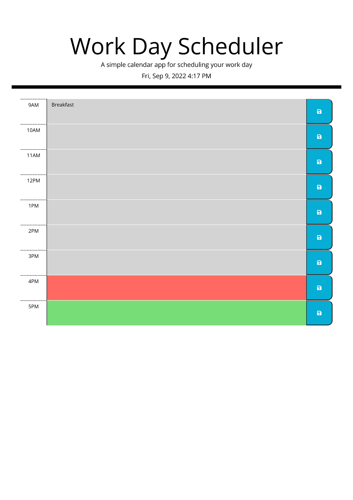

# Workday-Scheduler-Challenge-5

## Description
This is the fourth challenge in the Northwestern Coding Bootcamp (Module 4). We, the students, were to create a timed coding multiple-choice quiz with multiple questions, where correct answers were tracked and incorrect answers reduced the time faster. We were also required to store scores and user initials in our local storage so when we refresh the scores page or visit it on another day, the scores and initials still render.

For the first time, we also created a relatively plain html file and dynamically created the text, buttons, etc on the page using javascript. This was, by far, the most challenging aspect of the project.

## Link to live page
[Live Link](https://mbronstein1.github.io/Workday-Scheduler-Challenge-5/)

## Screenshot


## User Story

```md
AS AN employee with a busy schedule
I WANT to add important events to a daily planner
SO THAT I can manage my time effectively
```

## Acceptance Criteria

```md
GIVEN I am using a daily planner to create a schedule
WHEN I open the planner
THEN the current day is displayed at the top of the calendar
WHEN I scroll down
THEN I am presented with timeblocks for standard business hours
WHEN I view the timeblocks for that day
THEN each timeblock is color coded to indicate whether it is in the past, present, or future
WHEN I click into a timeblock
THEN I can enter an event
WHEN I click the save button for that timeblock
THEN the text for that event is saved in local storage
WHEN I refresh the page
THEN the saved events persist
```